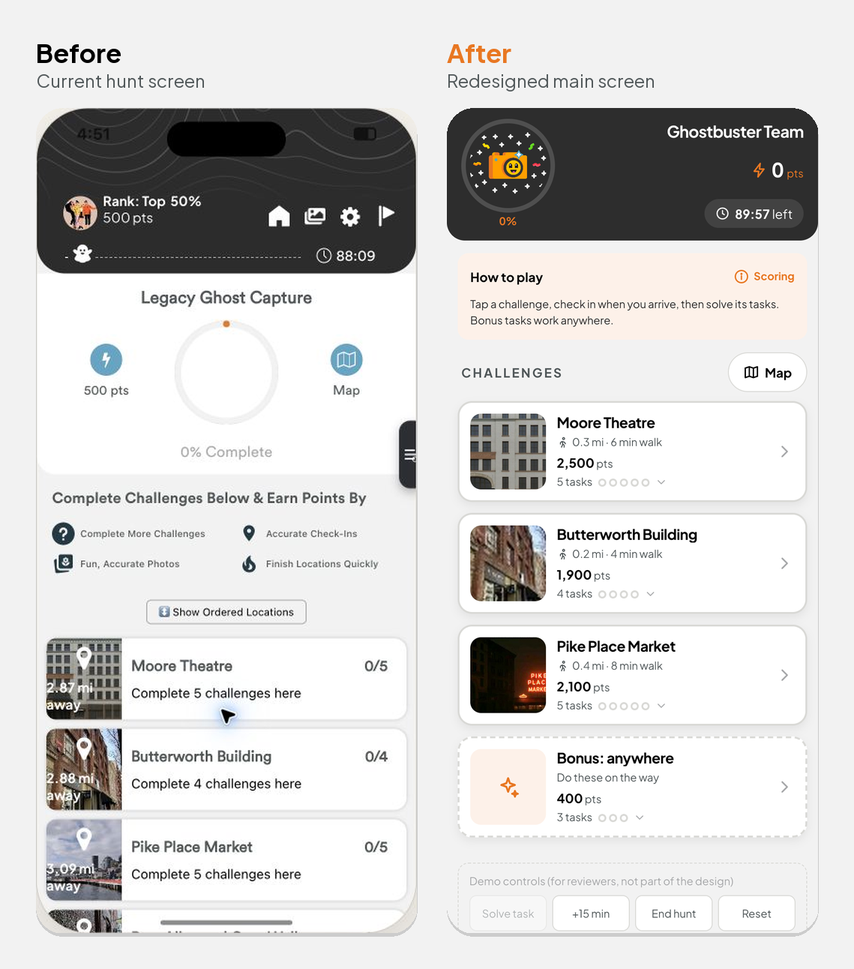
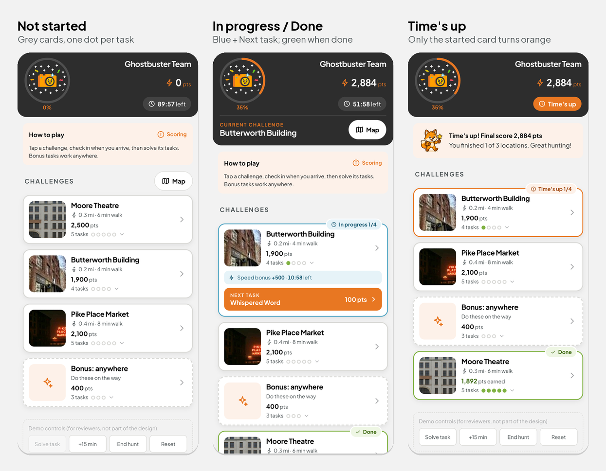

# Let's Roam — Main Hunt Screen Redesign

Frontend developer assessment: redesign the main scavenger-hunt screen to raise **completion rate**, **fun**, and **clarity**.

## For reviewers: start here

| | |
|---|---|
| **Try the design** (best on a phone) | https://askaera.github.io/letsroam-hunt-redesign/ |
| **Walkthrough video** (4 min, captions) | [Google Drive](https://drive.google.com/file/d/1LLTQX4x4VebBV_GleIZbKyjwy5TgJk-y/view?usp=sharing) |
| **Critique & recommendations** | [docs/DESIGN_CRITIQUE.md](docs/DESIGN_CRITIQUE.md) |
| **How the design evolved** | [docs/DESIGN_PROCESS.md](docs/DESIGN_PROCESS.md) |
| **AI transcript** | [AI_CONVERSATION_TRANSCRIPT.md](AI_CONVERSATION_TRANSCRIPT.md) |





In the live demo, tapping a card opens the current app's screens only when run locally with the provided build (see below). Use the **Demo controls** at the bottom to solve tasks, skip time or end the hunt.

## Repository layout

| Path | What it is |
|---|---|
| `redesign/` | The redesigned hunt screen — React + TypeScript + Vite demo |
| `docs/DESIGN_CRITIQUE.md` | Critique of the current design (§A), questions and ideas for the business (§B), and what the redesign implements (§C) |
| `docs/DESIGN_PROCESS.md` | Decision log: what was unclear, what I tried, what I decided |
| `docs/screens/` | Screenshots of the redesign |
| `AI_CONVERSATION_TRANSCRIPT.md` | Full AI conversation transcript |
| `redesign/src/styles/tokens/` | Color, type and effect tokens from the Let's Roam design system |

**Not included in this public repo:** the materials Let's Roam provided for the assessment (the current app build `Lets-Roam-Hunt-Demo`, the design system and the Ghost Tour screenshots). They're Let's Roam's property, so they stay local. Reviewers already have them.


## Run the redesign demo

Requires Node 18+.

```bash
cd redesign
npm install
npm run dev        # open the printed URL (best viewed at phone width, or in devtools device mode)
```

Production build: `npm run build && npm run preview`.

**Try it on a phone:** run `npm run dev -- --host` and open the printed *Network* URL on a phone on the same Wi-Fi.

### What to try
1. **Main screen** (the redesign): the list of challenges. Tap a card, e.g. Moore Theatre.
2. The **current app** opens, copied unchanged from the provided build: its location screen with **Check In**. These screens are out of scope and not redesigned; they show the build's own Denver demo content. Close it with ✕.
3. Back on the main screen, the opened challenge is **blue** at the top, with a speed-bonus countdown and a **Next task ›** shortcut, which opens the current app's challenge list.
4. **Map** shows every location and walking directions. **Scoring** explains the points.
5. Use the **Demo controls** at the bottom of the main screen:
   - **Solve task** stands in for answering a task in the current app, since the main screen can't see inside it. Solve every task and the card turns **green**.
   - **+15 min** passes a challenge's speed-bonus window, and its card turns **orange** (still finishable).
   - **End hunt** ends the timer. Challenges that were started but not finished turn orange; the rest keep their colors.
   - **Reset** starts over.

Progress is saved in `localStorage`, so a reload keeps your place. Add `?reset` to the URL (e.g. `http://localhost:5173/?reset`) to start a fresh hunt.

### Structure
```
redesign/src/
├── data/hunt.ts            hunt content: challenges, tasks, points (edit freely)
├── state/useHunt.ts        game rules: timers, unlock order, status colors, scoring
├── screens/HuntScreen.tsx  the redesigned main hunt screen
├── components/             Header, ChallengeRow (list card), Map / Scoring sheets, CurrentAppSheet, Icon
└── styles/                 design-system tokens (copied from reference/) + app.css
redesign/public/current-app/ the provided build of the current app, copied unchanged (opened when a card is tapped)
```

## Seeing the current app screens

Tapping a challenge card opens the **current app's** location and challenge screens, which are out of scope and not redesigned. To enable this, copy the provided `Lets-Roam-Hunt-Demo` folder to `redesign/public/current-app/`. Without it, the app shows a short note instead.

## Links

- **Walkthrough video** (4 min, with captions): https://drive.google.com/file/d/1LLTQX4x4VebBV_GleIZbKyjwy5TgJk-y/view?usp=sharing
- **Live demo:** https://askaera.github.io/letsroam-hunt-redesign/
- **Design:** designed directly in code, iterating on a phone. See [docs/DESIGN_PROCESS.md](docs/DESIGN_PROCESS.md) and [docs/DESIGN_CRITIQUE.md](docs/DESIGN_CRITIQUE.md) §C.
