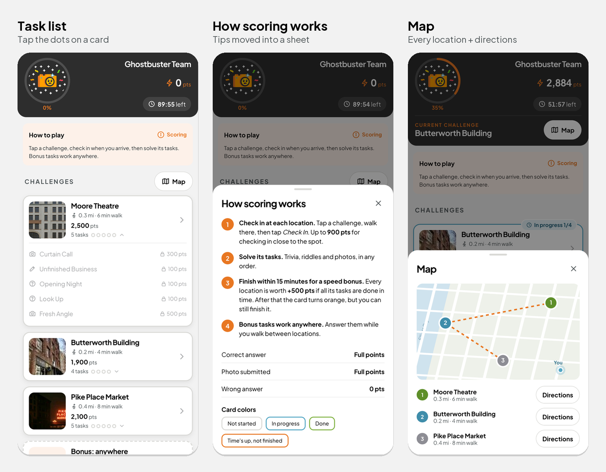

# Design Process & Decisions

I designed directly in code rather than in Figma, iterating on a real phone (Samsung Galaxy S22) with AI (Claude Code) as a pair. This log records the turning points: what was unclear, what I tried, and what I decided. The full conversation is in [`AI_CONVERSATION_TRANSCRIPT.md`](../AI_CONVERSATION_TRANSCRIPT.md).

---

## 1. Which screen is "the main hunt screen"?
- **Unclear:** the brief describes the screen teams "land on after starting an activity". The provided demo and the Ghost Tour flow show a list of locations *and* a location's list of tasks, and both are called "challenges".
- **Tried:** at first I planned the screen for one chosen challenge with its tasks.
- **Learned:** after comparing the demo with the screenshots, the main screen is the **overview of all challenges**. Teams return to it 5–6 times per hunt.
- **Decision:** redesign the overview; everything it leads to is out of scope.

## 2. Places vs single questions look the same
- **Unclear:** the current list mixes *places* (walk there, check in, 3–5 tasks inside) and *single questions* you can answer anywhere, with the same card. Even I couldn't tell them apart at first.
- **Decision:** name the two levels: a **challenge** is a place, and **tasks** live inside it. Anywhere-questions are grouped into one **"Bonus: anywhere"** card with a dashed border.

## 3. The time budget doesn't add up (business, not design)
- **Found:** about 3 mi of walking takes about 60 of the 90 minutes, leaving about 30 minutes for 14+ tasks. The app never says whether transit or a ride is allowed.
- **A correction along the way:** I first read "2.88 mi away" as the distance *between* stops. It's the distance from the player, and the stops are about a block apart.
- **Decision:** don't solve it in UI. List it as open questions and recommendations for the business in [DESIGN_CRITIQUE.md §B](DESIGN_CRITIQUE.md): transport, when the timer starts, the meaning of "completed", the speed bonus when riding, and more.

## 4. The top of the screen
- **Problem:** about 80% of the first screen was team name, a "0% complete" ring and four static tips.
- **Iterations:**
  1. A 3-row header with a progress bar.
  2. A progress ring around the avatar instead of the bar.
  3. Two columns.
  4. Final: avatar with the ring and % on the left; team name, points and timer stacked and right-aligned, with the points centred between them.
- **Also:** the "Current challenge" row with the Map button appears only once a challenge has been started.
- **Tips:** replaced by a two-line "How to play" plus a **Scoring** sheet with the real numbers.

## 5. The challenge card: one screen or two?
- **Tried:**
  - Version 1: expandable cards with the task list and a **Start** button inside every card.
  - Problems: four large orange buttons competed for attention, and teams could press Start before arriving, which starts the 15-minute window early.
- **Decision:** a lightweight card that leads to the existing screen:
  - photo, title (cut with "…" when long), distance, points, and "5 tasks" with one dot per task;
  - photo and text block share one height.
- **Kept:** the dots open a quick task list with each task's status.
- **Added:** a started challenge moves to the top, with a speed-bonus countdown and a **Next task ›** shortcut.

## 6. Scope discipline: reuse, don't rebuild
- **Mistake:** I recreated the next screens (location, check-in, challenge, result) in code.
- **Correction:** only the main screen is in scope, so the demo now opens the **provided build of the current app** unchanged. It isn't published here because it's Let's Roam's property.
- **Follow-up for the business:** the location screen doesn't show its tasks before check-in. If it did, the card could drop its task list and become lighter still ([critique §B2 #7](DESIGN_CRITIQUE.md)).

## 7. Colors that feel right
- **In progress:** yellow → **blue**, calmer, and it doesn't compete with the orange buttons.
- **Time's up:**
  - The first version turned *every* unfinished card **red**, including ones never started. It looked like failure.
  - Final: only a challenge that was **started but not finished** turns **brand orange**. Untouched challenges stay grey, and finished ones stay green.
  - The end banner is friendly: "You finished 1 of 3 locations. Great hunting!"

## 8. Consistency and polish
- **Type scale:** 10 font sizes collapsed into a 6-step scale (11 / 12 / 14 / 16 / 18 / 22), anchored to the design system.
- **Next task button:** three mismatched sizes became a two-line label.
- **Dropped:** the per-card "Route" link, since the header Map covers it.
- **Tested on a real device:** every change was checked on a phone and at 360 px width. A 30-second timer was used to test the end state.
- **Timer start:** I tried starting the timer at the first challenge, then reverted it. It became a business question instead: start at the team photo?

## What I'd do next
1. Get answers to the business questions in [§B2](DESIGN_CRITIQUE.md), especially transport and when the timer starts.
2. Show tasks on the location screen, then drop the task line from the card.
3. Test with real teams on a hunt, and measure completion per location.
